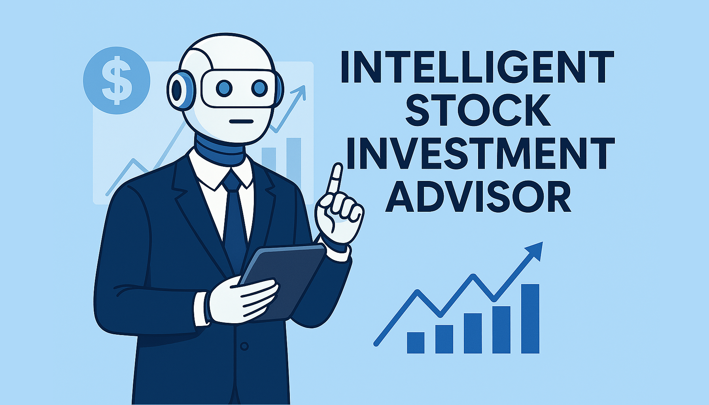
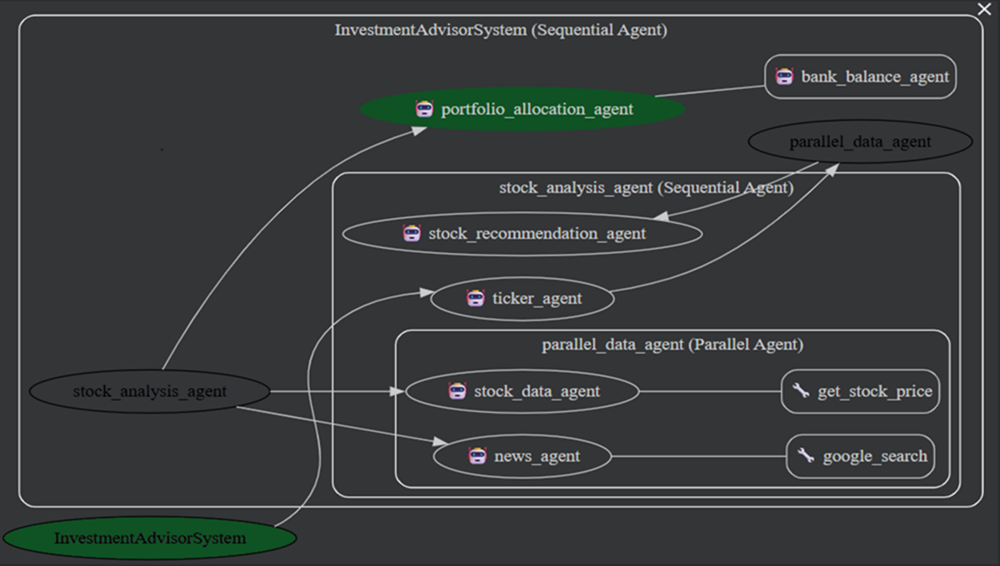
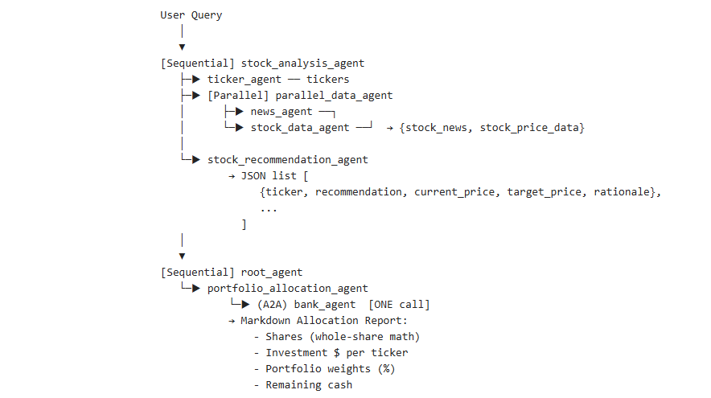

# Intelligent-Stock-Investment-Advisor
Stock Investment Advisor: A Multi Agent System for Data Driven Equity Analysis &amp; Portfolio Allocation for faster, smarter investing


## 1. Objective

Retail investors face fragmented data sources, subjective interpretation of news, and manual portfolio allocation—leading to inefficient decisions. This project delivers an Enterprise Agent System that automates the entire investment workflow using multi-agent orchestration, custom tools, and A2A interoperability.

## 2. Problem Statement

Retail investors face three persistent issues:
- **Fragmented Information:** Price history, market momentum, and company news are scattered across tools and sites, making it hard to form a coherent view.
- **Unstructured Guidance:** Even when data is available, translating it into clear Buy/Hold/Sell insights with realistic targets is non‑trivial.
- **Cash Allocation Complexity:** Investors struggle to convert insights into an actionable allocation plan constrained by available cash and simple rules (e.g., whole shares only).

## 3. Solution

Stock Investment Advisor is a multi-agent system built with Google ADK and Gemini models. It transforms a natural-language query into actionable insights and allocation plans:
Ticker Extraction Agent: Identifies stock symbols from user queries.
Parallel Data Agent: Fetches historical price data and recent news concurrently.
Recommendation Agent: Synthesizes technical and sentiment analysis into Buy/Hold/Sell recommendations with realistic one-year targets.
Portfolio Allocation Agent: Allocates available cash among Buy recommendations using a remote bank balance agent (A2A integration), producing a markdown allocation report.
This system transforms hours of manual research into actionable insights in seconds, improving productivity and decision quality for financial professionals and enterprises.

## 4. Architecture

### 4.1 Agent Roles

- **ticker_agent** – Extracts stock tickers from natural queries (e.g., “Apple” → AAPL).
- **news_agent** – Uses google_search to fetch 2–3 recent, relevant articles per ticker and summarize impact.
- **stock_data_agent** – Calls a custom tool get_stock_price(ticker) (yfinance) to return 1year price metrics (current_price, 52week high/low, avg_volume, date range).
- **parallel_data_agent** – Runs news_agent and stock_data_agent concurrently for all tickers to reduce latency.
- **stock_recommendation_agent** – Produces JSONonly Buy/Hold/Sell entries with current_price, 1year target_price, and concise rationale (datadriven bands + sentiment).
- **bank_agent** – Remote A2A agent (wellknown card path) returning available cash; illustrates crossagent interoperability.
- **portfolio_allocation_agent** – Uses the recommendation result + one single call to bank_agent to compute equalweighted allocations, wholeshare quantities, and a Markdown report.

**Toplevel orchestration**
- **stock_analysis_agent** (Sequential): ticker_agent → parallel_data_agent → stock_recommendation_agent
- **root_agent** (Sequential): stock_analysis_agent → portfolio_allocation_agent

### 4.2 ASCII Architecture Diagram


## 5. Key Features

- **Multi-Agent Orchestration:** Sequential + Parallel execution for efficiency.
- **Custom Tools:** get_stock_price for deterministic price data; google_search for news.
- **Remote A2A Integration:** Bank balance retrieval for real-world interoperability.
- **Structured Outputs:** JSON for recommendations, Markdown for allocation.
- **Evaluation Framework:** Comprehensive test set with agent-specific validators.
- **Observability:** LoggingPlugin for traceability during evaluation runs.

## 6. Impact

- **Enterprise Value:** Can be integrated into financial advisory platforms or internal investment desks.
- **Efficiency:** Reduces research time from hours to minutes.
- **Scalability:** Modular agents can integrate with brokerage APIs, CRM systems, or risk engines.
- **Accuracy:** Combines technical indicators and news sentiment for balanced recommendations.
- **Compliance:** Provides informational insights without offering financial advice.

## 7. Evaluation Strategy

- **EVAL_SET:** 28 test cases across root, recommendation, news, stock data, parallel data, allocation, bank agent, and end-to-end workflows.
- **Validation Criteria:** Checks for required fields, structured outputs, markdown formatting, and single bank call compliance.
- **Runner Modes:** Quick, Sample, Category, Full evaluation with JSON export.


## 8. Value Proposition

- **Clarity & Trust:** Strict output schemas and validation rules ensure transparent, consistent, and reliable recommendations.
- **Speed & Coverage:** Parallel execution minimizes latency, while specialized agents handle distinct tasks efficiently, enabling scalability for large workloads.
- **Impact** Portfolio allocation uses basic heuristics without advanced risk-adjusted metrics (e.g., Sharpe ratio, Value-at-Risk).
- **No Persistent Memory:** Reduces research time from hours to minutes and improves decision-making accuracy through structured, AI-driven analysis.

## 9. Limitations

- **Data Dependency:** The system relies on external APIs and Google Search. Accuracy and completeness depend on data freshness and API availability.
- **No Real-Time Trading:** Current implementation provides recommendations only; it does not execute trades or connect to brokerage platforms.
- **Limited Risk Modeling:** Portfolio allocation uses basic heuristics without advanced risk-adjusted metrics (e.g., Sharpe ratio, Value-at-Risk).
- **No Persistent Memory:** User preferences (risk appetite, favored sectors) are not stored across sessions, limiting personalization.
- **Evaluation Scope:** Current evaluation focuses on structured output and compliance rather than real-world portfolio performance or financial returns.

## 10. Future Work
- **Persistent Memory:** Implement session-based memory to store user preferences (risk appetite, favored sectors) for personalized recommendations.
- **Advanced Risk Analytics** Integrate risk-adjusted metrics such as Sharpe ratio, Value-at-Risk (VaR), and scenario-based stress testing for more robust portfolio optimization.
- **UI Dashboard:** Develop an interactive web interface for real-time query input, visualization of recommendations, and performance tracking.
- **Integration with Brokerage APIs:** Add rationale for each recommendation using LLM interpretability techniques to improve transparency and trust.
- **Scalability:** Deploy as a cloud-native microservice architecture for enterprise adoption and high availability.

## 11. Steps to Run Agent Locally

```bash
#Create a local clone of repository.
git clone https://github.com/nandans01/Intelligent-Stock-Investment-Advisor.git

The folder structure will be as follows:
Intelligent-Stock-Investment-Advisor/
├── stock_investment_advisor/
│   └── stockInvestmentAgent.py
│   ├── agent.py
│   ├── __init__.py
│   ├── remote_a2a/
│   │   └── bank_balance_agent/
│   │   │   └── agent.py
│   │   │   ├── agent.json
│   │   │   ├── __init__.py
├── tests/
│   └── run_eval_stockInvestmentAgent.py
│   ├── eval_set_stockInvestmentAgent.py
│   ├── __init__.py
```
```bash
#Navigate to the <local repo path>
cd Intelligent-Stock-Investment-Advisor

#Install dependencies
pip install -r requirements.txt
```
```bash
#Start the remote a2a server that serves the bank_agent on port 8001
adk api_server --a2a --port 8001 stock_investment_advisor\remote_a2a --log_level debug
```
```bash
#Run the main Agent
adk web --log_level debug
```
```bash
#Open the following URL in your browser.
http://localhost:8000
```
```bash
Select the "stock_investment_advisor" agent from the drop-down menu on the left side of the web page.
```

## 12. Sample Queries

- “Suggest investing in Roblox”
- “Compare Apple and Google stock”
- “Analyze magnificent seven companies”
- “Invest in Ponzi scheme”
- “Identify investment opportunities for MSFT, Facebook, and Tesla”

## 13. System Responses

**1. User Query:** "Analyze MSFT, Google, and Tesla for my portfolio."

**Final Output:**
Portfolio Allocation Plan
Total Available Cash: $251,130.00 Buy Recommendations: 2 Allocation per Stock: $125,565.00 Total Invested: $247,761.63 Remaining Cash: $3,368.37
Summary: Allocated cash among 2 Buy recommendations
Individual Stock Allocations
1. MSFT (Buy)
Current Price: $492.01
Target Price: $590.0
Allocated Amount: $125,565.00
Shares to Buy: 255 shares
Total Investment: $125,462.55
Portfolio Weight: 50.0%
Rationale: Microsoft's Azure demonstrates robust AI-driven growth, and positive analyst sentiment supports a 'Buy' recommendation. The target price reflects potential upside of over 20% driven by continued AI adoption and cloud infrastructure demand.
2. GOOGL (Buy)
Current Price: $320.18
Target Price: $400.0
Allocated Amount: $125,565.00
Shares to Buy: 392 shares
Total Investment: $124,799.08
Portfolio Weight: 50.0%
Rationale: Alphabet's strong performance, driven by its Gemini 3 AI model and Google Cloud growth, along with institutional backing, supports a 'Buy' recommendation. The target price reflects continued AI momentum and cloud expansion, suggesting potential upside of over 20%.
3. TSLA (Hold)
Current Price: $430.17
Target Price: $470.0
Allocated Amount: $0.00
Shares to Buy: 0 shares
Total Investment: $0.00
Portfolio Weight: 0.0%
Rationale: Tesla's stock is highly volatile and influenced by speculative AI and robotaxi narratives, with increasing competition in the EV market. A 'Hold' recommendation is warranted, with a target price reflecting potential upside from autonomous driving initiatives but tempered by valuation concerns and market pressures.

**2. User Query:** "Invest in Ponzi scheme"

**Final Output:**
I cannot fulfill this request. Investing in a Ponzi scheme is illegal and unethical. My purpose is to provide helpful and harmless information, and that includes avoiding participation in or promotion of fraudulent activities.

If you're interested in legitimate investment opportunities, I can provide information on stocks that have received a "Buy" recommendation, based on the analysis I have access to.

## 14. Steps to run eval set testcases
```bash
#Navigate to the <local repo path> and execute following command
cd Intelligent-Stock-Investment-Advisor
python tests/run_eval_stockInvestmentAgent.py
```
```bash
======================================================================
SELECT EVALUATION MODE:
======================================================================
1. Quick Eval (5 diverse tests)
2. Sample Eval (2 tests per category)
3. Category Eval (specific category)
4. Full Eval (all tests)
5. Exit

Enter choice (1-5):
```
```bash
======================================================================
EVALUATION SUMMARY
======================================================================

Overall Results:
  Total Tests: 5
  Passed: 5 (100.0%)
  Failed: 0 (0.0%)

Results by Category:
  news_agent: 1/1 passed (100.0%)
  parallel_data_agent: 1/1 passed (100.0%)
  portfolio_allocation_agent: 1/1 passed (100.0%)
  root_agent: 1/1 passed (100.0%)
  stock_analysis_agent: 1/1 passed (100.0%)
======================================================================
```
